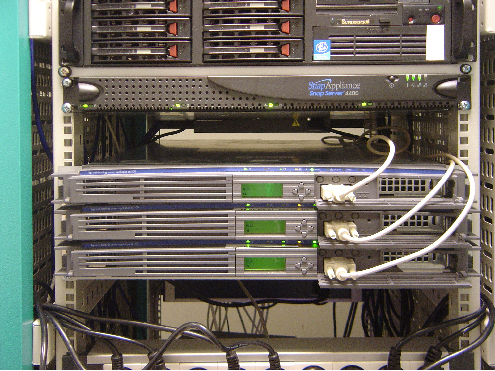

# Test web page
[ \[about\]](about.md)
## Test heading

### Test heading

### Test heading

#### Test heading

## Collapsable menues

 

This is the collapsable section 1 

In this section you will find all of the materials that relate to the section 1

This is some text after the heading with links <a href="#">This is a link</a>

  

*or use html tag img, make sure it's accessible with the right alt attribute description*

<quote>By <a href="//commons.wikimedia.org/wiki/User:David.Monniaux" title="User:David.Monniaux">David Monniaux</a>. Photo taken by myself with a cellular phone. Copyright © 2005 - Own work, <a href="http://creativecommons.org/licenses/by-sa/3.0/" title="Creative Commons Attribution-Share Alike 3.0">CC BY-SA 3.0</a>, <a href="https://commons.wikimedia.org/w/index.php?curid=90708">Link</a></quote>

<h2>This section has the details opened</h2>

 

This is the collapsable section 2 

 
<ul>
    <li>This is the bullet point 1</li>
    <li>This is the bullet point 2</li>
    <li>This is the bullet point 3</li>
    <li>This is the bullet point 4</li>
</ul>
 
<ol>
    <li>This is the ordered bullet point</li>
    <li>This is the ordered bullet point</li>
    <li>This is the ordered bullet point</li>
    <li>This is the ordered bullet point</li>
</ol>

---
## Tables

| Favorite food      | Ingredients      | Emotion      | Last experience     |
| ------------- | ------------- |---------------| -------------|
| Pizza | Carbs, cheese and meat | 😍😍😍😍 | `2025-03-05`|  
| Pasta  | Pasta, sauce and cheese | 😍😍😍😍 | `2025-03-03`| 

---
## Images

 *include images using md tag*

  

*or use html tag img, make sure it's accessible with the right alt attribute description*

<quote>By <a href="//commons.wikimedia.org/wiki/User:David.Monniaux" title="User:David.Monniaux">David Monniaux</a>. Photo taken by myself with a cellular phone. Copyright © 2005 - Own work, <a href="http://creativecommons.org/licenses/by-sa/3.0/" title="Creative Commons Attribution-Share Alike 3.0">CC BY-SA 3.0</a>, <a href="https://commons.wikimedia.org/w/index.php?curid=90708">Link</a></quote>

